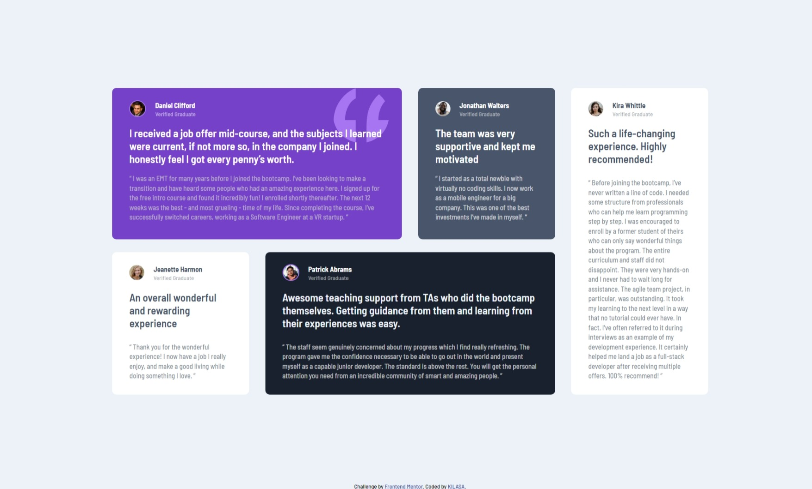

# Frontend Mentor - Testimonials grid section solution

This is a solution to the [Testimonials grid section challenge on Frontend Mentor](https://www.frontendmentor.io/challenges/testimonials-grid-section-Nnw6J7Un7). Frontend Mentor challenges help you improve your coding skills by building realistic projects.

## Table of contents

- [Overview](#overview)
  - [Screenshot](#screenshot)
  - [Links](#links)
- [My process](#my-process)
  - [Built with](#built-with)

## Overview

Purpose:

This website is designed to provide a quick and engaging introduction to HTML and CSS, the fundamental building blocks of web development using Flexbox and Grid. It aims to give you a basic understanding of these languages and how they work together to create web pages.

Additional Notes:

The simple and visually appealing design makes the information easy to consume.
The use of a hovering effect adds an interactive element to the page.
The website is likely part of a larger platform or blog focused on web development and learning.
In essence, this website offers a concise and visually engaging introduction to HTML and CSS, making it a great starting point for anyone interested in web development.

### Screenshot

### Links

- Solution URL: (https://github.com/gkilasonia/testimonials-grid-section)
- Live Site URL: (https://kilasa-testimonials-grid-section.netlify.app/)

## My process

### Built with

- Semantic HTML5 markup
- CSS custom properties
- Flexbox
- Grid
- Mobile-first workflow
- Responsive design
